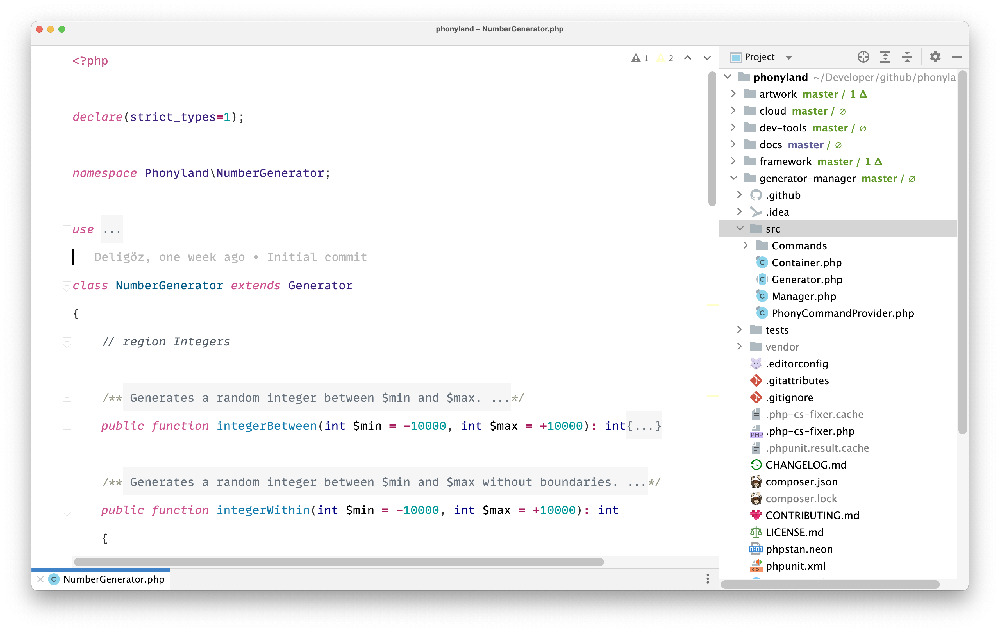
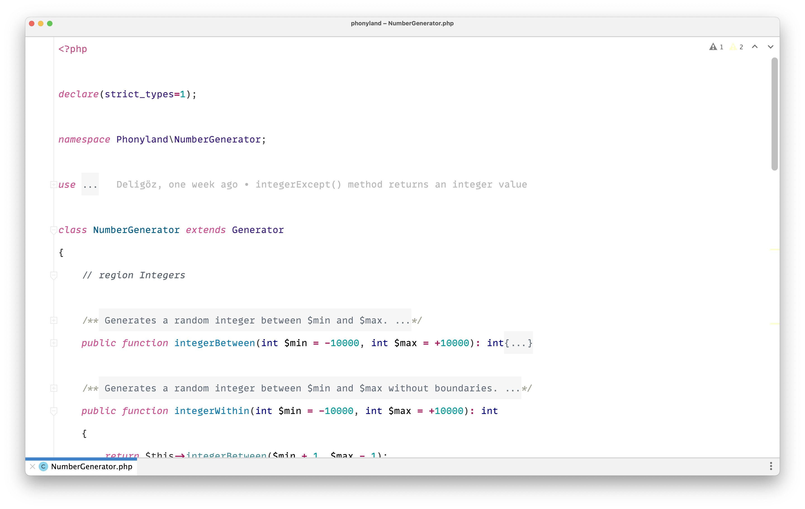
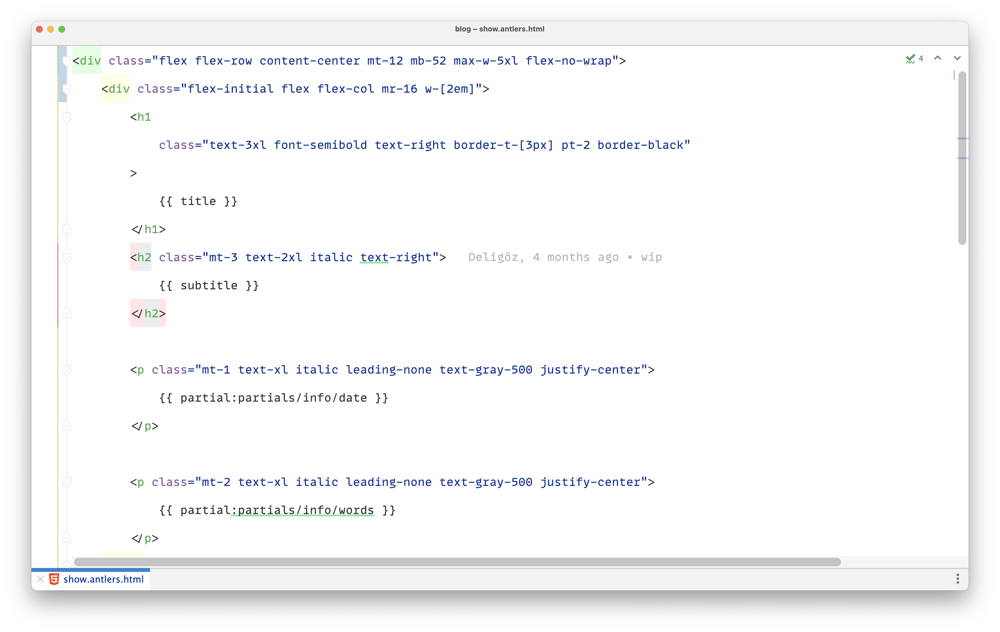
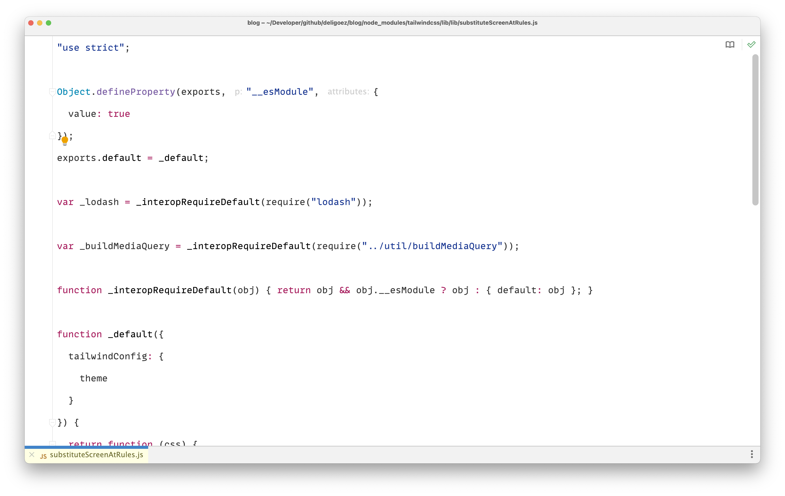
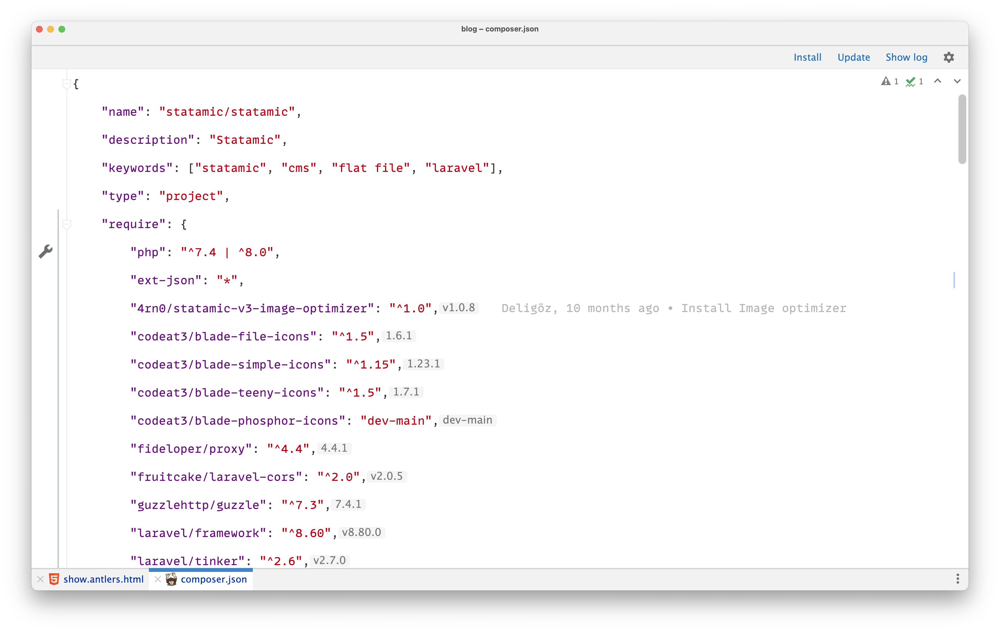
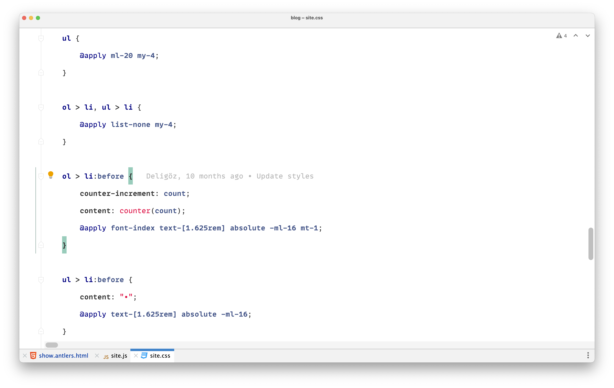
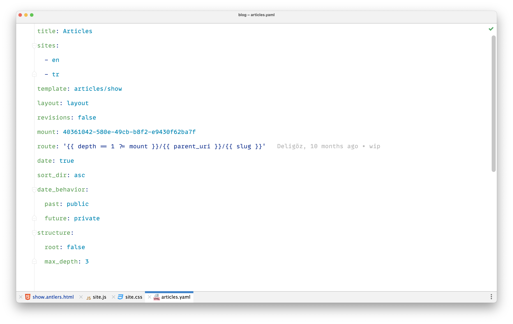

# Deligoez Theme

This is a minimalist light color scheme for PhpStorm.

## Installation

1. Download the [latest release](https://github.com/deligoez/phpstorm-deligoez-light-theme/releases)
2. Import and set `deligoez-light` scheme in `Preferences | Editor | Color Scheme`
3. Enjoy 🤟

## Fonts

- [Mono Lisa](https://www.monolisa.dev/)

## Screnshots

### PHP

### HTML

### Javascript

### JSON

### CSS

### YAML
